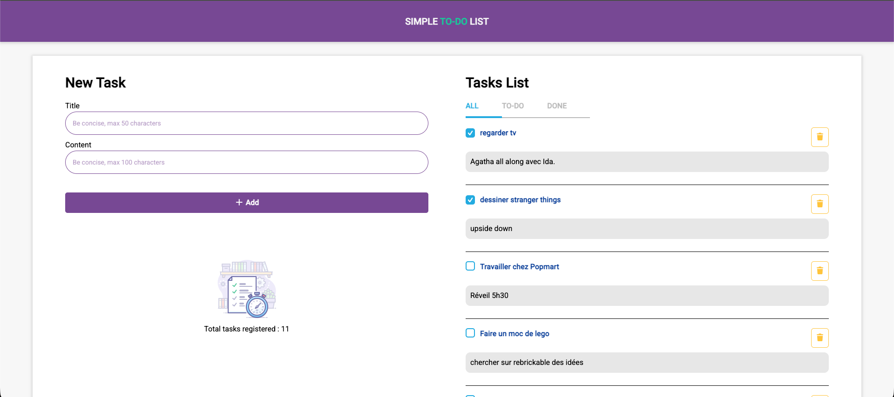

# Angular_Expressjs_todolist
This is a to-do list web app built using Angular, ExpressJS and MongoDB. The user can add, delete tasks, and mark them as done. He/She can also filter tasks that are ongoing or done. 

## Back-end

- Project initialization
```
npm install
```
- Run the project
```
npm start
```

## Front-end

- Project initialization
```
npm install
```
- Run the project
```
ng serve --open
```
- About building the front-end application
```
ng build
```
Then 
```
npx serve -s dist/frontend/browser
```
But before opening it on browser, you might make some changes on _dist/frontend/index.html_ first :
At line 4,


Instead of ```<base href="/">```, add a point as such : ```<base href="./">```

-----

Drop me a line if you have any advice or questions : sim.chiahuey@gmail.com


## Frontend

This project was generated with [Angular CLI](https://github.com/angular/angular-cli) version 21.2.9.

## Development server

Back end application : Run `npm start` for a dev server.

Front end application : Run `ng serve`, navigate to `http://localhost:4200/`. The app will automatically reload if you change any of the source files.

## Database
Create an account at Mongodb, create a collection which name will be your DB_NAME, and use your SRV connection strings that you can find on your MongoDB account interface in `Cluster` -> `Connect` -> `Drivers` (it starts with `mongodb+srv://`), which will be your MONGO_URI in your .env file.

## Code scaffolding

Run `ng generate component component-name` to generate a new component. You can also use `ng generate directive|pipe|service|class|guard|interface|enum|module`.

## Build

Run `ng build` to build the project. The build artifacts will be stored in the `dist/` directory.
To open the built project, run `npx serve -s dist/frontend/browser`. Don't forget to run back-end dev server for the whole project to work.

## Running unit tests

Run `ng test` to execute the unit tests via [Karma](https://karma-runner.github.io).

## Running end-to-end tests

Run `ng e2e` to execute the end-to-end tests via a platform of your choice. To use this command, you need to first add a package that implements end-to-end testing capabilities.

## Make it your todo-list
You can either run the project locally in a development environment and connect it to your own MongoDB database, or deploy it and use it as your own personal to-do list application.

## Further help

To get more help on the Angular CLI use `ng help` or go check out the [Angular CLI Overview and Command Reference](https://angular.io/cli) page.

